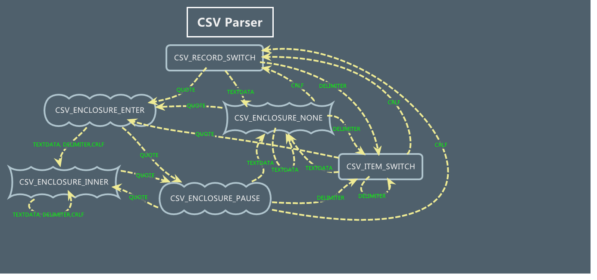

csv_parser_RFC4180
==================

基于 [RFC4180](http://www.rfc-editor.org/rfc/rfc4180.txt) 标准协议的 CSV 解析器

CSV 语法规则
------------

``` c++
file = [header CRLF] record *(CRLF record) [CRLF]

header = name *(COMMA name)
record = field *(COMMA field)

name = field
field = (escaped / non-escaped)
escaped = DQUOTE *(TEXTDATA / COMMA / CR / LF / 2DQUOTE) DQUOTE

non-escaped = *TEXTDATA
COMMA = %x2C
CR = %x0D ;as per section 6.1 of RFC 2234 [2]
DQUOTE = %x22 ;as per section 6.1 of RFC 2234 [2]
LF = %x0A ;as per section 6.1 of RFC 2234 [2]
CRLF = CR LF ;as per section 6.1 of RFC 2234 [2]
TEXTDATA =  %x20-21 / %x23-2B / %x2D-7E
```



特殊点
--------
* 代码量少。（性能稍差）
* 允许变化的字段数。
* 忽略 utf8 BOM 头。
* 以二进制读取文件，允许以"\r\n"或"\n"分隔记录。
* 允许在字段中间开始冒号引用。
* 允许字段中有回车。
* 允许二进制字段。
